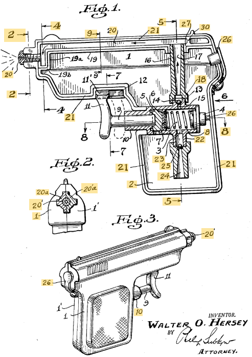
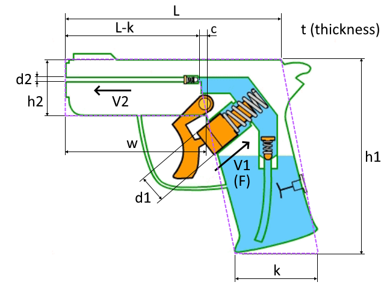
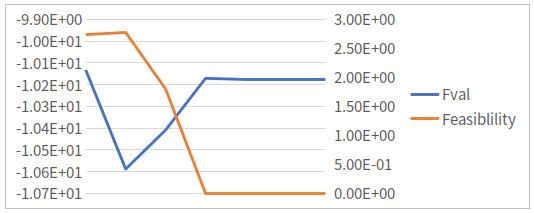

\section*{\center Final Report \break Dimensional Optimization Design of Water Gun}

Class: ME7129 Optimization in Engineering, National Taiwan University.

Student: Yuan Chang 張元, 吳聖麟

Due date: 2020-01-07

This PDF is generated from Markdown[@group-md], scripting in Matlab[@group-ml].

# Executive Summary

# Introduction

The patent Toy pistol (US2678753A[@patent]) is the model we used for reference.

{width=50%}

*A toy gun with a piston-type pump principle was first invented by Walter O. Hersey,
where the water storage cavity is contained in the body of the gun.
The water is ejected from the nozzle that operated by using fingers.
The piston uses the push on the lever trigger to reduce the volume of the cylinder,
thus forcing the water out of the gun barrel.
This force on the trigger causes a fast moving stream of water due to the constricted size of the barrel.*

# Problem Formulation

The project is to find the maximum volume of water gun, the volume is related to the length, height and thickness of the design. The length is related to the velocity of water, and the velocity is related to the pressure, wall friction and the water output at a time.

The design model shown as following:



The variables are $L$, $d_1$ and $d_2$.

The constants are shown as following:

| Symbol | Value | Unit |
|:------:|:-----:|:----:|
| $\rho$ | $10^3$ | N |
| $F$ | $180$ | N |
| $k$ | $7\times 10^{-2}$ | m |
| $h_1$ | $13\times 10^{-2}$ | m |
| $h_2$ | $5.5\times 10^{-2}$ | m |
| $t$ | $4\times 10^{-2}$ | m |
| $c$ | $2\times 10^{-2}$ | m |
| $\mu$ | $0.02$ | friction |
| $\tau$ | $12$ | Pa |
| $atm$ | $101325$ | Pa |

The objective function and constraints are:

$$
\begin{aligned}
\max_{L, d_1, d_2} f &= \rho g t[kh_1 + \frac{1}{2}h_2(w + L - k)] - \frac{\pi d_2^2}{4}
\\
\text{s. t. } g_1 &= d_1 - t \le 0
\\
g_2 &= d_2 - t \le 0
\\
g_3 &= k - L \le 0
\\
g_4 &= 5 - V_2 \le 0
\\
g_5 &= 10^{-5} - 0.05\pi d_2^2V_2 \le 0
\\
g_6 &= d_2 - d_1 \le 0
\\
\text{where } V_2 &= \frac{d_2^2(P_2 - \frac{4\tau(L - k)}{d_2^2} - atm)}{16\mu(L - k)}
\end{aligned}
$$

Among them, $g_1$, $g_2$, $g_3$ and $g_6$ are the dimensional constraints;
$g_4$ and $g_5$ represent the influences of the barrel length respect to the velocity.

And the constraints are tested with monotonicity table[@textbook],
which shows that the objective function and constraints are fully well bounded.

|     | $L$ | $d_1$ | $d_2$ |
|:---:|:---:|:-----:|:-----:|
| $f$ | $+$ |   | $-$ |
| $g_1$ |   | $+$ |   |
| $g_2$ |   | $+$ |   |
| $g_3$ | $-$ |   |   |
| $g_4$ | $+$ |   | $-$ |
| $g_5$ | $+$ |   | $-$ |
| $g_5$ |   | $-$ | $+$ |

# Optimization Results and Validation

The exit flag is 1 when using SQP algorithm and Genetic Algorithm.
For any initial variable at feasible domain, the result will always the same.
For an initial variable at infeasible domain, the variables maybe decline to the upper bound, and the result will become infeasible.
The result shows that the SQP algorithm found the convergence result successfully.

| $L$ | $d_1$ | $d_2$ | Answer | Feasible |
|:---:|:-----:|:-----:|:------:|:--------:|
| 4.52 | 0.01 | 0.003 | 10.1783 | Yes |



# Uncertainty Analysis

## Monte Carlo Method

## First Order Second Moment Method

# Matlab Programming

The Matlab source code are provided that the situations can be reproduced.

**Main Script**: main.m

The main script defines all constants and execute "fmincon" function.

```matlab
clc; clear; close all;

%% Constants
global N rho F k h1 h2 h3 t mu tao atm c mu_sigma success_rate
N = 1e6;
rho = 1e3;
F = 180;  % N
k = 7e-2;  % cm
h1 = 13e-2;  % cm
h2 = 5.5e-2;  % cm
h3 = 4e-2;  % cm
t = 4e-2;  % cm
mu = 0.02;
tao = 12;  % Pa
atm = 101325;  % Pa
c = 2e-2;  % cm
mu_sigma = 5;  % mu / sigma
success_rate = 1e-3;  % success rate

x = [4.5, 0.01, 0.01];
lb = 1e-6 * [1, 1, 1];
ub = 20 * [1, 1, 1];
op1 = optimoptions(@fmincon, 'Algorithm', 'sqp', 'Display', 'off');
op2 = optimoptions(@ga, 'Display', 'iter', 'PopulationSize', 100, 'MaxGenerations', 500,...
                   'MutationFcn', {@mutationadaptfeasible, 0.001});

%% Main
[x0, fval, flag0] = fmincon(@objective, x, [], [], [], [], lb, ub, @nonlcon, op1);
fprintf('Flag: %i\n', flag0);
fprintf('max f(L=%.10f, d1=%.10f, d2=%.10f) = %.10f\n', x0, -fval);
% f(L=4.5210353141, d1=0.0100000000, d2=0.0035682482) = 10.1782776911
is_feasible(x0);

%% Uncertainty
[x1, fval, flag1] = fmincon(@objective, x, [], [], [], [], lb, ub, @nonlcon_uncertainty, op1);
fprintf('Flag: %i\n', flag1);
fprintf('max f(L=%.10f, d1=%.10f, d2=%.10f) = %.10f\n', x1, -fval);
is_feasible(x1);

%% FOSM
[x2, fval, flag2] = fmincon(@objective, x, [], [], [], [], lb, ub, @fosm, op1);
fprintf('Flag: %i\n', flag2);
fprintf('max f(L=%.10f, d1=%.10f, d2=%.10f) = %.10f\n', x2, -fval);
is_feasible(x2);

%% Uncertainty Twice
[x3, fval, flag3] = fmincon(@objective, x2, [], [], [], [], lb, ub, @nonlcon_uncertainty, op1);
fprintf('Flag: %i\n', flag3);
fprintf('max f(L=%.10f, d1=%.10f, d2=%.10f) = %.10f\n', x3, -fval);
is_feasible(x3);
```

**Objective function**: objective.m

The volume of water gun will calculated here.

```matlab
function val = objective(x)
global rho k h1 h2 t c
L = x(1);
d2 = x(3);
val = -rho * t * (k * h1 + 0.5 * h2 * (2 * (L - k) + c)) -...
      (L - k) * pi * d2^2 / 4;
end
```

**Non-linear constraints**: nonlcon.m

The normal method of non-linear constraints.

```matlab
function [C, Ceq] = nonlcon(x)
global F k t mu tao atm
L = x(1);
d1 = x(2);
d2 = x(3);
l = L - k;
v2 = (4 * F / pi - 4 * tao * l - atm * d2^2) / (32 * mu * l);

C(1) = d1 - t;
C(2) = d2 - t;
C(3) = k - L;
C(4) = 5 - v2;
C(5) = 1e-5 - pi * d2^2 * v2 * 0.05;
C(6) = d2 - d1;
Ceq = [];
end
```

**Monte Carlo method**: nonlcon_uncertainty.m

The Monte Carlo method for three variations $L$, $d_1$ and $d_2$.

```matlab
function [C, Ceq] = nonlcon_uncertainty(x)
global N F k t mu tao atm mu_sigma success_rate
persistent Pr
if isempty(Pr)
    Pr = @(a) sum(a) / N;
end
rnd = mvnrnd(x, (x * mu_sigma).^2 .* [1, 0, 0; 0, 1, 0; 0, 0, 1], N);
L = rnd(:, 1);
d1 = rnd(:, 2);
d2 = rnd(:, 3);
l = L - k;
v2 = (4 * F / pi - 4 * tao .* l - atm * d2.^2) ./ (32 * mu * l);

C(1) = Pr(d1 - t > 0);
C(2) = Pr(d2 - t > 0);
C(3) = Pr(k - L > 0);
C(4) = Pr(5 - v2 > 0);
C(5) = Pr(1e-5 - pi * d2.^2 .* v2 * 0.05 > 0);
C(6) = Pr(d2 - d1 > 0);
C = C - success_rate;

Ceq = [];
end
```

**First Order Second Moment method**: fosm.m

THe FOSM method for three variations $L$, $d_1$ and $d_2$.

The coefficients are same as Monte Carlo method.

```matlab
function [C, Ceq] = fosm(x)
global F k t mu tao atm mu_sigma success_rate
L = x(1);
d1 = x(2);
d2 = x(3);

mu_g(1) = d1 - t;
mu_g(2) = d2 - t;
mu_g(3) = k - L;
mu_g(4) = 5 - (4 * F / pi - 4 * tao * (L - k) - atm * d2^2) / (32 * mu * (L - k));
mu_g(5) = 1e-5 - pi * d2^2 * (4 * F / pi - 4 * tao * (L - k) - atm * d2^2) /...
          (32 * mu * (L - k)) * 0.05;
mu_g(6) = d2 - d1;

sig = (x * mu_sigma).^2;
sigma_g(1) = sig(2);
sigma_g(2) = sig(3);
sigma_g(3) = sig(1);
sigma_g(4) = (-2 * d2 * atm / (32 * mu * (L - k)))^2 * sig(3) +...
             ((-4 * tao * 32 * mu * (L - k) -...
             32 * mu * (4 * F / pi - 4 * tao * (L - k) - atm * d2^2)) /...
             (32 * mu * (L - k))^2)^2 * sig(1);
sigma_g(5) = (0.2 * pi * d2^3 / (32 * mu * (L - k)))^2 * sig(3) +...
             ((-0.2 * tao * pi * d2^2 * 32 * mu * (L - k) -...
             32 * mu * pi * d2^2 * (4 * F / pi - 4 * tao * (L - k) - atm * d2^2)) /...
             (32 * mu * (L - k))^2)^2 * sig(1);
sigma_g(6) = sig(2) + sig(3);
sigma_g = sqrt(sigma_g);

C = 1 - normcdf(-mu_g ./ sigma_g) - success_rate;
Ceq = [];
end
```

**Test feasiblity**: is_feasible.m

A function used to test the variables of results.

```matlab
function is_feasible(x)
[C, ~] = nonlcon(x);
if all(C <= 1e-6)
    fprintf('Feasible\n');
else
    fprintf('Infeasible\n');
end
end
```

# Summary

# Bibliography
