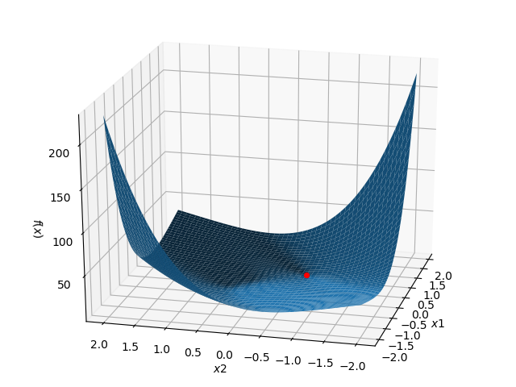
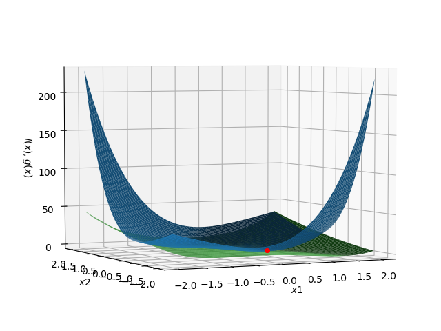
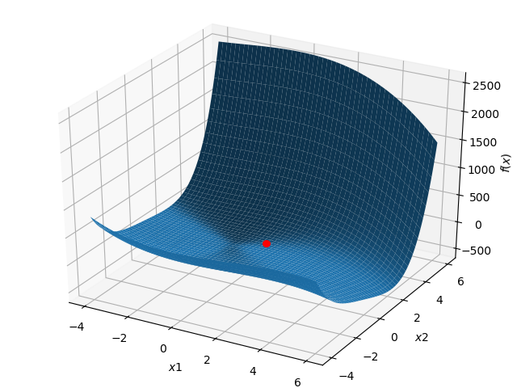

\section*{\center Homework 1}

Class: ME7129 Optimization in Engineering, National Taiwan University.

Student: Yuan Chang

Due date: 2019-09-24

This PDF is generated from Markdown[@homework1-md], scripting in Python[@homework1-py].

# Model Representation and Visualization

1. $f(x) = (x_2 - x_1)^4 + 8 x_1 x_2 - x_1 + x_2 + 3$ in the interval $-2 \le x_i \le 2$.

    {width=70%}

2. $f(x)$ as above and the constraint $g(x) = x_1^4 - 2 x_2 x_1^2 + x_2^2 + x_1^2 - 2 x_1 \ge 0$.

    {width=70%}

    Found minimum $1.4436$ at $(0.2839, -0.7785)$ with SLSQP (Sequential Least SQuares Programming) algorithm[@slsqp].
    The original minimum $0.9441$ is at $(0.55, -0.56)$.
    The constraint alter the minimum location.

# Analytical Solution with Model Reduction

$$
\begin{aligned}
\text{minimize } & \omega = 88.9dt
\\
\text{subject to } & g_1 : dt \ge 0.0885
\\
& g_2 : d \ge 0.9
\\
& g_3 : t \ge 0.05
\end{aligned}
$$

{.class width=70%}

Found minimum $7.6576$ at $(0.9930, 0.0867)$ with SLSQP algorithm.

# Boundedness Behavior

$f(x) = -x_2 - 2 x_1 x_2 + x_1^2 + x_2^2 - 3 x_1^2 x_2 - 2 x_1^3 + 2 x_1^4$ around the point $(1, 1)^T$.

{.class width=70%}

Found minimum $-7.7352 \times 10^{24}$ at $(156890273.4507, 208864.4760)$ with SLSQP algorithm. This function has no any clear extreme value in the plot.

# Reference
