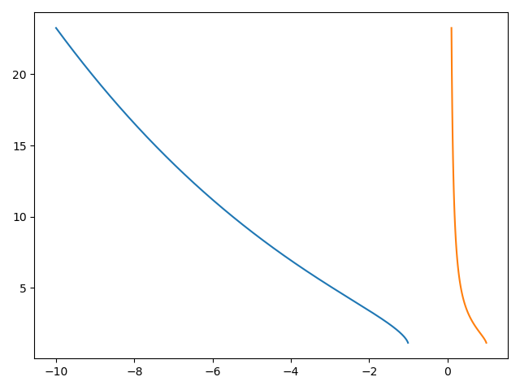
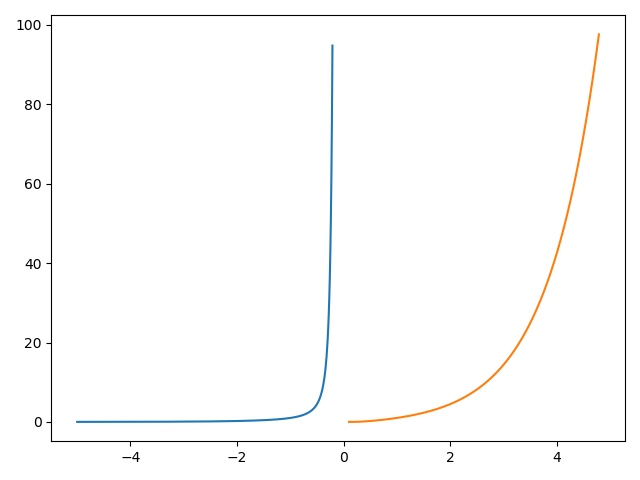

\section*{\center Homework 2}

Class: ME7129 Optimization in Engineering, National Taiwan University.

Student: Yuan Chang

Due date: 2019-10-08

This PDF is generated from Markdown[@homework2-md], scripting in Python[@homework2-py].

# Functional Monotonicity Analysis

1. $e^{\sqrt{x^{-1}(1-x^2)}}$

    We known the $x$ can not be zero, and $\frac{1-x^2}{x}$ must greater or equal than zero (for square root).
    The range of $x$ is $\{-\infty < x \le -1\}$ and $\{0 < x \le 1\}$.
    The differential function $f'(x)$ is:

    $$f'(x) = -\left(\frac{1+x^2}{2x^2\sqrt{\frac{1-x^2}{x}}}\right)e^{\sqrt{\frac{1-x^2}{x}}}$$

    Because of $x^2$ must greater than zero,
    so $1+x^2$ and $e^{\sqrt{\frac{1-x^2}{x}}}$ will greater than zero as well.
    This makes $f'(x)$ lower than zero in range $\{-\infty < x \le -1\}$ and $\{0 < x \le 1\}$.
    The function is decreasing monotonic $f(x^-)$.
    The plot looks like:

    {width=75%}

1. $\sin(x^2 + \ln{y^{-1}})$

    Since "sine" is a periodic function, so this function is not monotonic with $\{-\infty < x < \infty\}$ and $\{0 < y < \infty\}$.

1. $e^x / e^{\frac{1}{x}}$

    The function can be simplified as $e^{x-\frac{1}{x}} = e^{\frac{x^2-1}{x}}$,
    and $x$ must not equal than zero.
    The range of $x$ is $\{-\infty < x < 0\}$ and $\{0 < x < \infty\}$.
    The differential function $f'(x)$ is:

    $$f'(x) = \frac{x^2+1}{x^2}e^{\frac{x^2-1}{x}}$$

    Because of $x^2$ and $e^{\frac{x^2-1}{x}}$ must greater than zero,
    so the function is increasing monotonic $f(x^+)$.
    The plot looks like:

    {width=75%}

1. $\int_{a}^{b} \exp(-xt)dt$

    The function can be write as:

    $$\frac{df(x, t)}{dt} = e^{-xt}$$

    The exponential function returns always positive, so:

    + If $a<b$, the function is increasing monotonic $f(t^+)$.
    + If $a>b$, the function is decreasing monotonic $f(t^-)$.

# Well-Boundedness

$$
\begin{aligned}
\text{maximize } f & = x_1 - x_2
\\
\text{subject to } g_1 & = 2x_1 + 3x_2 - 10 \le 0
\\
g_2 & = -5x_1 - 2x_2 + 2 \le 0
\\
g_3 & = -2x_1 + 7x_2 - 8 \le 0
\end{aligned}
$$

Minimize $-f$ has same result of this objective function,
where $-f = -x_1 + x_2$.
The monotonicity table shown as:

|   | $x_1$ | $x_2$ |
|:---:|:---:|:-----:|
| $-f$ | $-$ | $+$ |
| $g_1$ | $+$ | $+$ |
| $g_2$ | $-$ | $-$ |
| $g_3$ | $-$ | $+$ |

By MP1, w.r.t. $x_1$ and $g_1$ is active, w.r.t. $x_2$ and $g_2$ is active.
Solving $g_1=0$ and $g_2=0$, get $x_1=-\frac{14}{11}$ and $x_2=\frac{46}{11}$.

But the results are not feasible with $g_3$.
Since the Monotonicity Principles are only applicable with well-constrained minimization problem.
w.r.t. $x_1$ and $g_1$ is active, makes $g_1=0$ to eliminate $x_1$, we got:

$$
\begin{aligned}
-f(x_2^+) & = 2.5x_2 - 5
\\
g_2(x_2^+) & = 5.5x_2 - 23 \le 0
\\
g_3(x_2^+) & = 10x_2 - 18 \le 0
\end{aligned}
$$

Where the lower bound of $x_2$ did'n exist, the problem is unbounded.

# Constraints Analysis

$$
\begin{aligned}
\text{minimize } f & = 2x_3 - x_4
\\
\text{subject to } g_1 & = x_3 - 3x_4 \le 4
\\
g_2 & = 3x_3 - 2x_4 \le 3
\\
g_3 & = x_2 - x_3 \le 2
\\
g_4 & = x_3 + x_4 \le 7
\\
g_5 & = x_3 + 3x_4 \le 5
\\
h_1 & = -x_1 + x_2 - x_3 + x_4 = 2
\\
h_2 & = x_2 + x_3 = 6
\end{aligned}
$$

The monotonicity table shown as:

|   | $x_1$ | $x_2$ | $x_3$ | $x_4$ |
|:---:|:---:|:-----:|:-----:|:-----:|
| $f$ |   |   | $+$ | $-$ |
| $g_1$ |   |   | $+$ | $-$ |
| $g_2$ |   |   | $+$ | $-$ |
| $g_3$ |   | $+$ | $-$ |   |
| $g_4$ |   |   | $+$ | $+$ |
| $g_5$ |   |   | $+$ | $+$ |

1. Which variables are relevant, irrelevant?

    With MP2, w.r.t. $x_1$, equation $h_1$ must be inactive,
    and has no effect on objective function $f$.
    So $x_1$ is irrelevant; $x_2$, $x_3$ and $x_4$ are relevant.

1. Which constraints form conditionally critical sets?

    With MP1, w.r.t. $x_4$, inequalities $\{g_4, g_5\}$
    is conditionally critical set.
    By MP2, w.r.t. $x_2$, it can be directed to $h_2=6$.
    With MP1, w.r.t. $x_3$, inequalities $\{g_3\}$
    is conditionally critical set.

1. Which constraints are uncritical?

    With MP1, w.r.t. $x_3$ and $x_4$, inequalities $g_1$ and
    $g_2$ are uncritical.

1. Which constraints are dominant?

    Possible constraints are $g_3$, $g_4$ and $g_5$.

    Constraint $g_3$ is dominat.
    Solving $h_2$ and $g_3$ obtains $x_2 \le 4$ then eliminate it at $g_4$ and $g_5$.
    We got $g_4$ is dominat instead of $g_5$.

1.  Rewrite the model with irrelevant variables deleted and dominated constraints relaxed,
    and indicate critical constraints.

    Substitute the model with $h_2$.
    Eliminating $x_3$ by $x_3=6-x_2$, we got:

    $$
    \begin{aligned}
    f & = 12 - 2x_2 - x_4
    \\
    g_1 & = 2 - x_2 - 3x_4 \le 0
    \\
    g_2 & = 15 - 3x_2 - 2x_4 \le 0
    \\
    g_3 & = x_2 - 4 \le 0
    \\
    g_4 & = -x_2 + x_4 - 1 \le 0
    \\
    g_5 & = 1 - x_2 + 3x_4 \le 0
    \end{aligned}
    $$

    And the monotonicity table becomes:

    |   | $x_1$ | $x_2$ | $x_3$ | $x_4$ |
    |:---:|:---:|:-----:|:-----:|:-----:|
    | $f$ |   | $-$ |   | $-$ |
    | $g_1$ |   | $-$ |   | $-$ |
    | $g_2$ |   | $-$ |   | $-$ |
    | $g_3$ |   | $+$ |   |   |
    | $g_4$ |   | $-$ |   | $+$ |
    | $g_5$ |   | $-$ |   | $+$ |

    With MP1, w.r.t. $x_2$, found $g_3$ critical.

    With MP1, w.r.t. $x_4$, found $g_5$ critical.

1. Is this reduced problem constraint bounded?

    Two variables $x_2$ and $x_4$ have lower and upper bounds,
    the problem is constraint bounded.

1. Does the reduced problem have multiple critical constraints?

    No.

1. Solve the original problem.

    Solved all constraints $g_1$ to $g_5$, the constarints have conflict.
    So the problem has no any feasible solution.

# Monotonicity Table

$$
\begin{aligned}
\text{minimize } f & = C_1h^2l + C_2lbt + C_3bt
\\
g_1 & = K_1 - hl \le 0
\\
g_2 & = K_2 - bt^2 \le 0
\\
g_3 & = h - b \le 0
\\
g_4 & = K_3 - bt^3 \le 0
\\
g_5 & = (K_4t + K_5) / b^3t - 1 \le 0
\\
g_6 & = K_6 - h \le 0
\end{aligned}
$$

1. Use monotonicity tables to construct an optimized
parametric procedure for sizing the bar weldment.

    The monotonicity table shown as:

    |   | $l$ | $h$ | $b$ | $t$ |
    |:---:|:---:|:---:|:---:|:---:|
    | $f$ | $+$ | $+$ | $+$ | $+$ |
    | $g_1$ | $-$ | $-$ |   |   |
    | $g_2$ |   |   | $-$ | $-$ |
    | $g_3$ |   | $+$ | $-$ |   |
    | $g_4$ |   |   | $-$ | $-$ |
    | $g_5$ |   |   | $-$ | $-$ |
    | $g_6$ |   | $-$ |   |   |

    With MP1, w.r.t. $l$, inequality $g_1$ is a critical constarint.
    Substitute the model with $g_1=0$.
    Eliminating $l$ by $l=\frac{K_1}{h}$, we got:

    $$
    \begin{aligned}
    f & = C_1hK_1 + \frac{K_1}{h}C_2bt + C_3bt
    \\
    g_2 & = ... \text{ (no changed)}
    \end{aligned}
    $$

    Then same as $g_6$ to $h$, $g_4$ to $t$ and $g_2$ to $b$.
    We found them are critical to those variables.

1. Test it for the following parameter values used by Ragsdell and Phillips:
C1 = 1.105, C2 = 0.6735, C3 = 0.0481, K1 = 1.52, K2 = 16.8, K3 = 9.08,
K4 = 0.0278, K5 = 0.0943, K6 = 0.125.
They give the minimizing design as l = 6.72, h = 0.226, b = 0.245, t = 8.27.

    The given parameters and variables are violate the constraints $g_1$, $g_2$ and $g_5$.

# Reference
