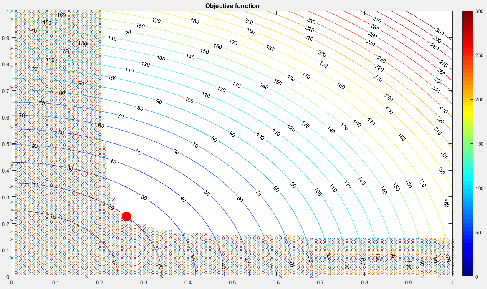

\section*{\center Homework 3}

Class: ME7129 Optimization in Engineering, National Taiwan University.

Student: Yuan Chang

Due date: 2019-11-08

This PDF is generated from Markdown[@homework3-md], scripping in Matlab[@homework3-ml].

**The original Matlab code has been modified ALL OVER for better readability and performance.**

# Ten Bar Truss Problem

Please use 'fmincon' in Matlab to obtain the deterministic optimal design.

$$
\begin{aligned}
\min_{r_1, r_2} f &= 6\pi r_1^2l + 4\pi r_2^2\sqrt{2}l
\\
F_i' &\le P_i^c = \frac{\pi^2EI_i}{l_i'^2}
\\
\sigma_i &\le \sigma_Y
\\
\delta_2 &\le 2
\end{aligned}
$$

The parameters are: $\rho$, $F$, $E$, $l$ and $\sigma_Y$, where:

$$
\begin{aligned}
\rho &= 7860 \text{ kg/m}^3
\\
F_{1\sim3} &= 0 \text{ N}
\\
F_4 &= -1\times 10^7 \text{ N}
\\
F_{5\sim12} &= 0 \text{ N}
\\
E &= 200\times 10^9 \text{ Pa}
\\
l &= 9.14 \text{ m}
\\
\sigma_Y &= 250\times 10^6 \text{ Pa}
\end{aligned}
$$

The boundary conditions of the variables:

$$
\begin{aligned}
0 \le x_1 &= r_1 \le 100
\\
0 \le x_2 &= r_2 \le 100
\end{aligned}
$$

Expand and normalize the constraints into negative null form:

$$
\begin{aligned}
F_i' &= |\sigma_i| A_i = |\sigma_i| \pi r_i^2
\\
I_i &= \frac{\pi r_i^4}{4}
\\
P_i^c &= \frac{\pi^3 r_i^4 E}{4l_i'^2}
\\
g_{1\sim6} &= |\sigma_{1\sim6}| \pi r_1^2 - \frac{\pi^3r_1^2E}{4l_{1\sim6}'^2} \le 0
\\
g_{7\sim10} &=  |\sigma_{7\sim10}| \pi r_2^2 - \frac{\pi^3r_2^2E}{4l_{7\sim10}'^2} \le 0
\\
g_{11\sim20} &= |\sigma_{1\sim10}| - \sigma_Y \le 0
\\
g_{21} &= \delta_2 - 2 \le 0
\end{aligned}
$$

Where yield strengths $\sigma_i$ will transform into scalars $|\sigma_i|$ since
the comparisons are including both compressing and stretching.

And the interior forces $F_i'$ and the deformed lengths $l_i'$ are also changed,
so they are not used as the original $F$ and $l$.

**Used a customized option in "fmincon" function, which chosen
"SQP" algorithm for the following test.**

## Try at least three different starting points. Are the results the same?

Tested 7 results in the following table:

| Start point | Result | Is the same |
|:-----------:|:------:|:-----------:|
| $(1, 1)$ | $f(0.2606346250, 0.2223656116) = 19.7350646658$ | O |
| $(20.5, 20.5)$ | $f(0.2606346250, 0.2223656116) = 19.7350646658$ | O |
| $(30.6, 30.6)$ | $f(0.2606346292, 0.2223656055) = 19.7350645987$ | $\Delta$ |

In fact, the results have little bit different ($\Delta$, $10^{-7}$)
but will not cause too much impact.

## What are the optimal values of all cross sections?

With the start point $(1, 1)$ above:

$$f(0.2606346250, 0.2223656116) = 19.7350646658$$

There are two types of radius, $r_1$ respact to bar $1\sim6$, $r_2$ respact to bar $7\sim10$.
The cross sections are $\pi r_1^2 = 0.2134 \text{ m}^2$, $\pi r_2^2 = 0.1553 \text{ m}^2$.

## What is the minimal weight of the truss obtained?

The minimal value $v = 19.7350646658$ obtains $v\rho = 155117.6082732070$ kg.

## How was your design problem terminated?

The terminated state with the initial value $(1, 1)$:

| State | Value |
|:------|:------|
| Exit code | $1$ |
| Iteration | $13$ |
| Function count | $47$ |
| Step size | $4.0283\times 10^{-9}$ |
| First order optimality | $4.546\times 10^{-6}$ |

The message says:

Local minimum found that satisfies the constraints.
Optimization completed because the objective function is non-decreasing in
feasible directions, to within the default value of the optimality tolerance,
and constraints are satisfied to within the default value of the constraint tolerance.

Stopping criteria details:
Optimization completed: The relative first-order optimality measure, 5.062019e-08,
is less than options.OptimalityTolerance = 1.000000e-06, and the relative maximum constraint
violation, 0.000000e+00, is less than options.ConstraintTolerance = 1.000000e-06.

## Which constraint(s) is(are) active?

For each constraint $g_i$, disable one by one to show the changes or not.

| Disabled | Result | Is changed |
|:--------:|:-------|:----------:|
| No | $f(0.2606346254, 0.2223656112) = 19.7350646658$ | The original one |
| $g_{1\sim3}$ | $f(0.2606346253, 0.2223656113) = 19.7350646658$ | $\Delta$ |
| $g_4$ | $f(0.2606346254, 0.2223656112) = 19.7350646658$ | X |
| $g_{5\sim6}$ | $f(0.2606346254, 0.2223656112) = 19.7350646658$ | X |
| $g_{7\sim10}$ | $f(0.2606346254, 0.2223656112) = 19.7350646658$ | X |
| $g_{11}$ | $f(0.2606346254, 0.2223656112) = 19.7350646658$ | X |
| $g_{12}$ | $f(0.2606346254, 0.2223656112) = 19.7350646658$ | X |
| $g_{13}$ | $f(0.2606346254, 0.2223656112) = 19.7350646658$ | X |
| $g_{14}$ | $f(0.2606346254, 0.2223656112) = 19.7350646658$ | X |
| $g_{15}$ | $f(0.2606346254, 0.2223656112) = 19.7350646658$ | X |
| $g_{16}$ | $f(0.2606346254, 0.2223656112) = 19.7350646658$ | X |
| $g_{17}$ | $f(0.2606346254, 0.2223656112) = 19.7350646658$ | X |
| $g_{18}$ | $f(0.2606346254, 0.2223656112) = 19.7350646658$ | X |
| $g_{19}$ | $f(0.2606346254, 0.2223656112) = 19.7350646658$ | X |
| $g_{20}$ | $f(0.2606346254, 0.2223656112) = 19.7350646658$ | X |
| $g_{21}$ | $f(0.1687868853, 0.1703866153) = 9.6238827016$ | O |

After the test, disabled constraints $g_{21}$ will change the result.
So apparently it is active to the objective function.
Minor errors ($\Delta$, $10^{-10}$) can be ignored.

## Please provide a rationale that you have found the correct result.

According to the plot of objective function, the optimal values $(r_1, r_2)$ are
on the boundary and meet the gradiant of the objective function.
So this result is the correct answer.

# Reference
