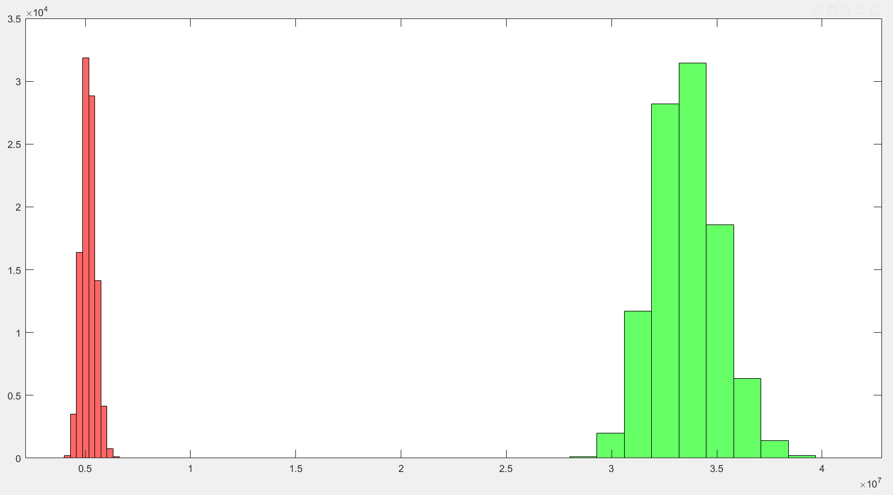
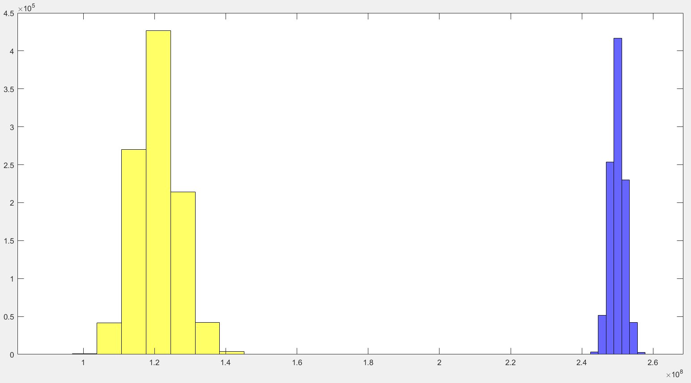

\section*{\center Homework 4}

Class: ME7129 Optimization in Engineering, National Taiwan University.

Student: Yuan Chang

Due date: 2019-11-26

This PDF is generated from Markdown[@homework4-md], scripting in Matlab[@homework4-ml].

# Uncertainty Analysis of the Ten-Bar Truss

## Please obtain the final distribution of the stress at bar 5 and 6

Ran with $10^6$ times.

Where red and green data is bar 5 and 6 respectively.

## What is the probability of Bar 1 failing using Monte Carlo Simulation (MCS) with 1 million samples

Bar 1 is constrained by:

$$
\begin{aligned}
g_1 &= |\sigma_1| \pi r_1^2 - \frac{\pi^3r_1^2E}{4l_1'^2} \le 0
\\
g_2 &= |\sigma_1| - \sigma_Y \le 0
\end{aligned}
$$

After test, there is no failed in Monte Carlo Simulation.

Where yellow and blue data is bar 1 and $Y$ respectively.
The plot represents there is no intersection between the stress of bar 1 and the limitation.

# Reference
