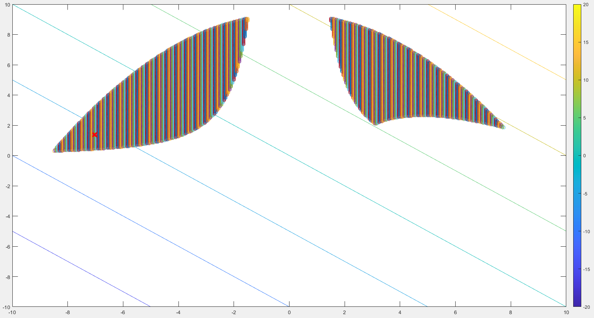
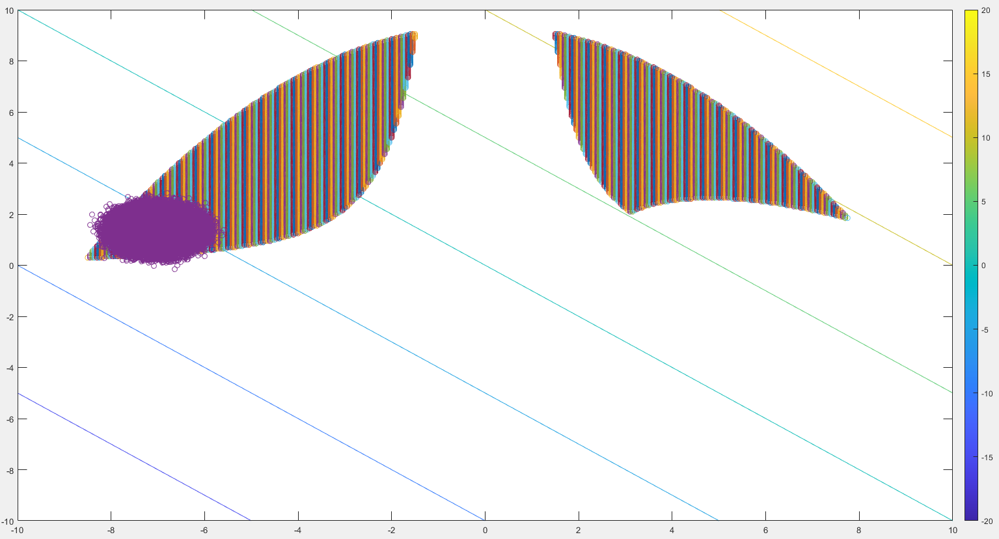

\section*{\center Homework 5}

Class: ME7129 Optimization in Engineering, National Taiwan University.

Student: Yuan Chang

Due date: 2019-12-10

This PDF is generated from Markdown[@homework5-md], scripting in Matlab[@homework5-ml].

# Design under Uncertainty

$$
\begin{aligned}
X &= N(x, 0.3^2)
\\
G_i &= \text{Pr}[g_i(X) > 0] - 0.0013 \le 0
\end{aligned}
$$

## Please use Monte Carlo simulation with 100 samples to solve the problem. Rerun twice, are the results different? Did you face convergence difficulties? Why?

Solved with SQP failed, return code -2.

The algorithm might be confused by random constraints when searching on the unstable boundaries.

## Please use Monte Carlo simulation with 1 million samples to solve the problem. Rerun twice, are the results different? Did you face convergence difficulties? Why?

Solved with SQP failed, return code -2.

The algorithm might be confused by random constraints when searching on the unstable boundaries.

Even we increase the probability, it does not seem to improve the stability of the boundary.

## Please use FOSM to solve the problem. Use Monte Carlo to verify the failure probability at the optimal. Did you get 99% results? Why not?

The formulas of FOSM:

$$
\begin{aligned}
\mu_{g_i} &= g_i(x)
\\
\sigma_{g_i} &= \sqrt{\sum_j(\frac{\partial g_i}{\partial x_j}\sigma_{x_j})^2}
\\
G_i &= 1 - \text{normcdf}(-\frac{\mu_{g_i}}{\sigma_{g_i}}) - 0.0013 \le 0
\end{aligned}
$$

Solved with SQP and initial point $(-6.5, 2.1)$, return code 1.

$$
f(-7.0276763692, 1.3751068918) = -5.6525694774
$$

The initial values is decided by feasible domain of original constraints, which shown as follow:

$$
\{g_1(x) <= 0\} \cap \{g_2(x) <= 0\} \cap \{g_3(x) <= 0\}
$$

Where the cross sign is FOSM result.

Taking this value as the initial value back to the second question, we will get a return code 0.
The message said: "Number of iterations exceeded `options.MaxIterations` or number of function evaluations exceeded `options.MaxFunctionEvaluations`."

Above result shows that the solution is the optimum, which caused algorithm didn't get any feasible step.

Then check the guessed points of the new mean, which shown as follow:

Ideally, the initial values can be any point in the feasible solution unless too close with the boundaries.
After the iteration process, the mean point and its point cloud (random values) will move to the optimum gradually.

But in the actual case, our result is not meet the rules when using SQP method.

# Reference
