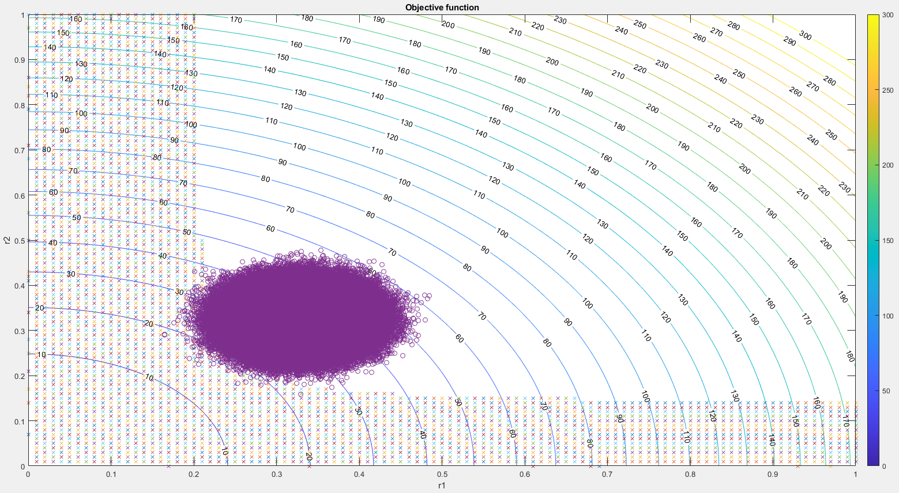

\section*{\center Homework 6}

Class: ME7129 Optimization in Engineering, National Taiwan University.

Student: Yuan Chang

Due date: 2019-12-27

This PDF is generated from Markdown[@homework6-md], scripting in Matlab[@homework6-ml].

# Design Optimization of a Ten-Bar Truss under Uncertainty

Deterministic design:

$$
\begin{aligned}
\min_{r_1, r_2} f &= 6\pi r_1^2l + 4\pi r_2^2\sqrt{2}l
\\
\text{subject to } (F_{\text{new}})_i &\le P_i^c = \frac{\pi^2EI}{(l_{\text{new}})_i^2}
\\
\sigma_i &\le \sigma_Y
\\
\delta_2 &\le 0.02
\\
i &= \{c \in \mathbb{Z} | 1 \le c \le 10\}
\end{aligned}
$$

Where the subscript "new" is present that the value is calculated from the FEA function.

The parameters are: $\rho$, $F$, $E$, $l$ and $\sigma_Y$:

$$
\begin{aligned}
\rho &= 7860 \text{ kg/m}^3
\\
F_{1\sim3} &= 0 \text{ N}
\\
F_4 &= -1\times 10^7 \text{ N}
\\
F_{5\sim12} &= 0 \text{ N}
\\
E &= 200\times 10^9 \text{ Pa}
\\
l &= 9.14 \text{ m}
\\
\sigma_Y &= 250\times 10^6 \text{ Pa}
\end{aligned}
$$

Let the variables $r = \{r_1, r_2\}$ replaced with variations $R = \{R_1, R_2\}$
and forces $F$ replaced with $F_{\text{Random}}$ using Gaussian distribution.

$$
\begin{aligned}
0 &< r < \infty
\\
\sigma_r &= (0.1r)^2
\\
\sigma_F &= (0.1F)^2
\\
R &= N(r, \sigma_r)
\\
F_{\text{Random}} &= N(F, \sigma_F)
\end{aligned}
$$

Expand and normalize the constraints into negative null form:

$$
\begin{aligned}
(F_{\text{new}})_i &= |\sigma_i| A_i = |\sigma_i| \pi r_i^2
\\
I_i &= \frac{\pi r_i^4}{4}
\\
P_i^c &= \frac{\pi^3 r_i^4 E}{4(l_{\text{new}})_i^2}
\\
g_{1\sim6} &= |\sigma_{1\sim6}| \pi r_1^2 - \frac{\pi^3r_1^2E}{4(l_{\text{new}})_{1\sim6}^2} \le 0
\\
g_{7\sim10} &=  |\sigma_{7\sim10}| \pi r_2^2 - \frac{\pi^3r_2^2E}{4(l_{\text{new}})_{7\sim10}^2} \le 0
\\
g_{11\sim20} &= |\sigma_{1\sim10}| - \sigma_Y \le 0
\\
g_{21} &= \delta_2 - 0.02 \le 0
\end{aligned}
$$

## Please rewrite the mathematical formulation of the design problem with uncertainty

$$
\begin{aligned}
\min_{r_1, r_2} f &= 6\pi r_1^2l + 4\pi r_2^2\sqrt{2}l
\\
\text{subject to } g_{1\sim6} &= \text{Pr}[|\sigma_{1\sim6}| \pi R_1^2 - \frac{\pi^3R_1^2E}{4(l_{\text{new}})_{1\sim6}^2} > 0] - 0.0013 \le 0
\\
g_{7\sim10} &=  \text{Pr}[|\sigma_{7\sim10}| \pi R_2^2 - \frac{\pi^3R_2^2E}{4(l_{\text{new}})_{7\sim10}^2} > 0] - 0.0013 \le 0
\\
g_{11\sim20} &= \text{Pr}[|\sigma_{1\sim10}| - \sigma_Y > 0] - 0.0013 \le 0
\\
g_{21} &= \text{Pr}[\delta_2 - 0.02 > 0] - 0.0013 \le 0
\end{aligned}
$$

Where $(l_{\text{new}})_i$, $\delta_i$ and $\sigma_i$ are calculated by uncertainties $R$ and $F_{\text{Random}}$.

The $\text{Pr}$ function will sum up all happened result then divide with the total number of times.

## Please use Monte Carlo simulation with 100 samples to solve the problem. Rerun twice, are the results different? Did you face convergence difficulties? Why?

Start with values $[0.3293, 0.3246]$, result flag -2 and $x$ is **lower bound**.

The SQP algorithm might be confused by random gradian when searching on the unstable boundaries.

After tried Genetic Algorithm, the result is also -2. Each generation runs very slowly.

## Please use Monte Carlo simulation with 1 million samples to solve the problem. Rerun twice, are the results different? Did you face convergence difficulties? Why?

Start with values $[0.3293, 0.3246]$, result flag -2 and $x$ is **lower bound**.

The SQP algorithm might be confused by random gradian when searching on the unstable boundaries.

## Please use FOSM to solve the problem. Use Monte Carlo to verify the failure probability at the optimal. Did you get 99% results? Why not?

The formulas of FOSM:

$$
\begin{aligned}
\mu_{g_i} &= g_i(x)
\\
\sigma_{g_i} &= \sqrt{\sum_j(\frac{\partial g_i}{\partial x_j}\sigma_{x_j})^2}
\\
G_i &= 1 - \text{normcdf}(-\frac{\mu_{g_i}}{\sigma_{g_i}}) - 0.0013 \le 0
\end{aligned}
$$

The partial differential of the constraints can be determined by:

$$
\frac{\partial g_i}{\partial x_j} = \left. \frac{g_i(x_0, \dots, x_j + \Delta x_j, \dots) - g_i(x)}{\Delta x_j} \right |_{\Delta x_j\rightarrow 0^+}
$$

For the variables $r$ and $F$, the $\sigma_{g_i}$ will be:

$$
\begin{aligned}
\sigma_{g_i} &= \sqrt{(\frac{\partial g_i}{\partial r_1}\sigma_{r_1})^2 + (\frac{\partial g_i}{\partial r_2}\sigma_{r_2})^2 + (\frac{\partial g_i}{\partial F}\sigma_F)^2}
\\
&= \sqrt{\begin{aligned}
&(\frac{g_i(r_1 + \Delta r_1, r_2, F) - g_i(r_1, r_2, F)}{\Delta r_1}\sigma_{r_1})^2 +
\\
&(\frac{g_i(r_1, r_2 + \Delta r_2, F) - g_i(r_1, r_2, F)}{\Delta r_2}\sigma_{r_2})^2 +
\\
&(\frac{g_i(r_1, r_2, F + \Delta F) - g_i(r_1, r_2, F)}{\Delta F}\sigma_F)^2
\end{aligned}}
\end{aligned}
$$

After executed SQP algorithm with an initial values $[0.3293, 0.3246]$, the result flag is -2, but we obtained $x = [0.329818090602828, 0.323336750073526]$.

# Reference
